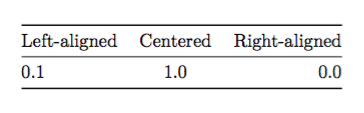
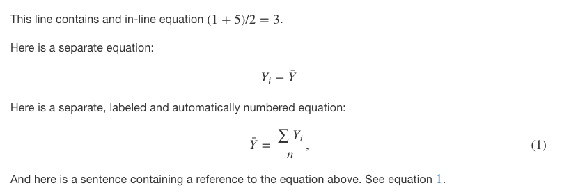
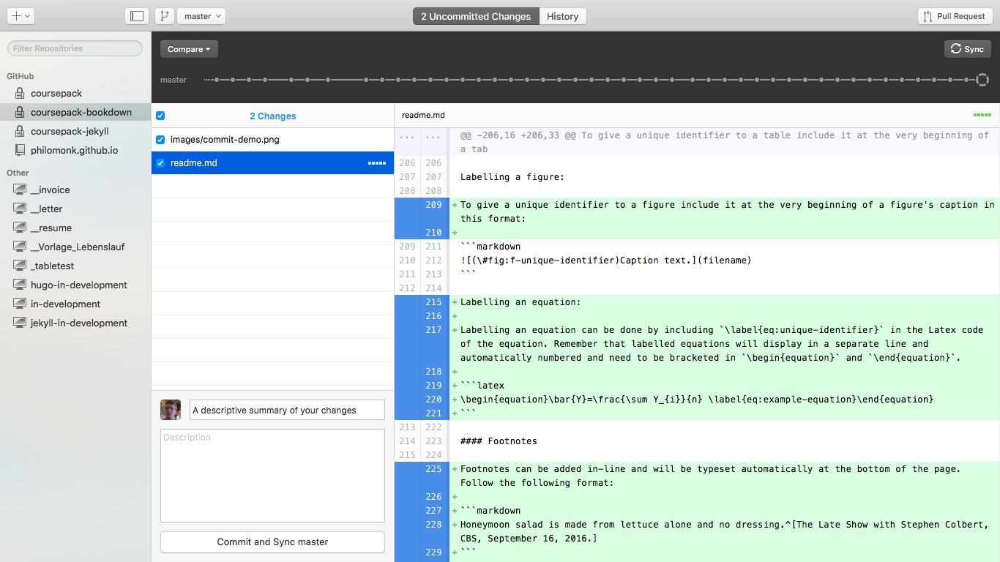

### In-house authoring and publishing process for the Department of Methodology at the London School of Economics and Political Science

# Goal
The goal of the project documented here was to develop and provide a new and improved in-house authoring and publishing process for the Department of Methodology at the LSE.

Specifically, the new process should

(1) allow authors to add or make changes to a manuscript without requiring the use or knowledge of any particular software or language other than Git, and

(2) automatically produce a book-form website, a pdf printable, and an ebook from one and the same source file in Plain Text Markdown.

# How To

The prototype of this in-house authoring and publishing process that is before you implements the course pack for the Department of Methodology's MY451 course "Introduction to Quantitative Analysis". The published course pack can be seen on <https://kbenoit.github.io/coursepack-bookdown/>.

The manuscript for that course pack is stored online at <https://github.com/kbenoit/coursepack-bookdown>. To make changes to that manuscript you need Git installed on your computer. One way to do that is to download GitHub Desktop [here](https://desktop.github.com/) and install it. Depending on your operating system you may have to restart your computer after installation.

# Download project folder from online repository
In order to make changes to the manuscript of the MY451 course pack you need to download the project folder that contains the manuscript files. To download a project folder is also called "to clone a repository". In order to do just that follow these steps:
<!--^[Instructions taken verbatim from <https://help.github.com/desktop/guides/contributing/cloning-a-repository-from-github-to-github-desktop/>.]-->

1. Sign in to GitHub and GitHub Desktop before you start to clone.
2. On GitHub, navigate to the main page of the repository.
3. Under your repository name, click Clone or download.
4. Click Open in Desktop to clone the repository and open it in GitHub Desktop.
5. In GitHub Desktop, after verifying the name and location on your hard drive where you'd like to clone the repository, click Clone.

Now you have an exact and complete copy of the project folder on your computer and are ready to make changes to it.

# Make changes

The manuscript of class MY451 is stored in files with the extension `.Rmd`. One file per chapter. That means you'll find twelve Rmd files in your newly "cloned" project folder. The beginning of the course pack, in this case the preface, is stored in `index.Rmd`. The ten subject chapters plus the appendix are stored in numbered Rmd files. The number of these chapter manuscript files accord to the order you want those chapters to be in in the course pack.

To make changes to the course pack manuscript go ahead and open one of the Rmd files with a text editor of your choice. Make sure to disable soft line wrapping in your editor for the Rmd files to display correctly. If you are familiar with how those manuscript files looked before, you'll notice a stark difference. As opposed to the old manuscript files, the new ones before you are visually coherent and human-readable. That is because they rely on an authoring convention called Markdown. More specifically, Pandoc-flavored Markdown.

## Markdown

Like HTML or Latex, Markdown is a way to mark elements of text for what we want them to be. Unlike HTML or Latex, however, Markdown requires minimal know-how while affording most of the functionalities of HTML or Latex. The only text elements in the manuscript before you that require knowledge of Latex are equations. Keep reading for an overview of writing in Markdown.

### Headings, Lists, Emphasis

**Headings, headers, or titles** are made by putting a hash (`#`) in front of them and having them be preceded by a blank line.

The number of hashes determines the level of the heading:

```markdown
...ending of previous paragraph.

# This is a top-level header

## This is a level 2 header

### This is a level 3 header
.
.

###### This is a level 6/bottom-level header
```

or

```markdown

# Chapter

## Section

### Subsection

#### Subsubsection
```

By default, headers will automatically be numbered in the output (the website, the printable, the ebook) according to their level and position in the manuscript. Some headers, however, you may not want to be numbered -- for example level 4-6 headers or headers in the preface or appendix. In order to exclude those from being automatically numbered append `{-}` like so:

```markdown

# Appendix {-}

```

**Numbered lists** can be created this way:

```markdown
1. First item
2. Second item
3. Third item
```

**Unnumbered lists** can be created this way:
```markdown
* unnumbered item
  + subitem
    - subsubitem
  + subitem
+ item
  + subitem
```

Any string of text -- words, phrases, headers, paragraphs -- can be **emphasized** by bracketing it in asterisks like so:

```markdown
*Italicize* with a single asterisk before and after.

Make text **bold** with two asterisks.

Turn text ***bold and italic*** with three asterisks.
```

### Tables

A **simple table** can look like this:

```markdown
  Region               Frequency   Proportion       %
  ------------------ ----------- ------------ -------
  Africa                      48        0.310    31.0
  Asia                        44        0.284    28.4
  Europe                      34        0.219    21.9
  Latin America               23        0.148    14.8
  Northern America             2        0.013     1.3
  Oceania                      4        0.026     2.6
  Total                      155        1.000   100.0

  : (\#tab:t-region)Frequency distribution of the region variable in the country data.
```

You'll notice that the horizontal rule and its breaks determine the number of rows.

The alignment of a row is determined by where you place the content of the first line in relation to the horizontal rule. It does not matter where exactly you place the remaining content as long as it is within the row. In the output, the entire row will be aligned according to the first line:

```markdown
Left-aligned   Centered   Right-aligned
------------- ---------- --------------
    0.1              1.0 0.0

```

Becomes:



A **multiline table** with cells that take up more than one line can look like the one below. In multiline tables it is crucial that
* the table begins and ends with a row of dashes,
* rows are separated by blank lines, and that
* the bottom row of dashes is followed by a blank line

```markdown
-------------------------------------------------------------
 Centered   Default           Right Left
  Header    Aligned         Aligned Aligned
----------- ------- --------------- -------------------------
   First    row                12.0 Example of a row that
                                    spans multiple lines.

  Second    row                 5.0 Here's another one. Note
                                    the blank line between
                                    rows.
-------------------------------------------------------------

  : Example of a multiline table.
```

Captions can be added to tables following the example above. For how to add unique identifiers to tables see ["Anchors, Labels, Identifiers and referencing them"](#anchors-labels-identifiers-and-referencing-them) below.

### Figures

The format for inserting a figure -- in other words an image -- is:

```markdown


```

It is important that in the manuscript you give the file name without a file extension as shown above and that you provide one and the same image in two file formats: `.pdf` and `.png`.

So in order to insert into the manuscript a figure we call "bar_attitude" it needs to read in the manuscript something like this:

```markdown


```

and the project folder needs to include both `bar_attitude.pdf` and `bar_attitude.png`. This is to meet the challenges of both print and screen output.

Assuming a figure you made is available in .eps format or .pdf, you can produce a pdf or png file using your operating system's standard picture viewer. On Mac OS X, for example, open an image file with the Preview app and click "File" > "Export..."" > then choose output format PNG > select path to project folder > click "Save".

### Equations

Equations need to be authored in Latex. **In-line equations** need to be bracketed with a dollar sign. A blank space is necessary before the opening `$` and after the closing `$`.

**Separate equations** need to be bracketed with double dollar signs. Again, a blank space is necessary before the opening `$$` and after the closing `$$`.

**Separate, labeled and automatically numbered equations** need to be bracketed with `\begin{equation}` and `\end{equation}` respectively.

```markdown
This line contains and in-line equation $(1+5)/2=3$.

Here is a separate equation:

$$Y_{i}-\bar{Y}$$

Here is a separate, labeled and automatically numbered equation:

\begin{equation}\bar{Y}=\frac{\sum Y_{i}}{n}, \label{eq:example-equation}\end{equation}

And here is a sentence containing a reference to the equation above. See equation \@ref(eq:example-equation).
```

In the output it will look like this:



### Anchors, Labels, Identifiers and referencing them

Headers, Tables, Figures, and Equations can be given unique identifiers, also called anchors or labels, that allows you to reference them elsewhere in the manuscript. A unique identifier numbers an item automatically. When you reference that unique identifier elsewhere in the manuscript the dynamically associated number will be shown in the output. At the moment, equations can only be referenced dynamically inside the same manuscript file, in other words, inside the same chapter.

Labelling a header:

```markdown
# Introduction {unique-identifier}
```

A header can only *either* be given a unique identifier *or* be made unnumbered (`{-}`).

Labelling a table:

To give a unique identifier to a table include it at the very beginning of a table's caption in this format:

```markdown
: (\#tab:t-unique-identifier)Caption text with no space between unique identifier and caption text.
```

Labelling a figure:

To give a unique identifier to a figure include it at the very beginning of a figure's caption in this format:

```markdown

```

Labelling an equation:

Labelling an equation can be done by including `\label{eq:unique-identifier}` in the Latex code of the equation. Remember that labelled equations will display in a separate line and automatically numbered and need to be bracketed in `\begin{equation}` and `\end{equation}`.

```latex
\begin{equation}\bar{Y}=\frac{\sum Y_{i}}{n} \label{eq:example-equation}\end{equation}
```

### Footnotes

Footnotes can be added in-line and will be typeset automatically at the bottom of the page. Follow the following format:

```markdown
Honeymoon salad is made from lettuce alone and no dressing.^[The Late Show with Stephen Colbert, CBS, September 16, 2016.]
```

# Upload changed manuscript files to online repository

Once you have made and saved changes to any file in the project folder, they will show up in the repository in your GitHub Desktop app.

In order for you to be able to upload your changes your GitHub account needs to be registered as a contributor to the project's repository. Ask the project repository's owner for that privilege.

To upload the changed files, which is also called "pushing" changes, go to your GitHub Desktop app. Select the project repository on the left-hand side where your repositories are listed. Enter a brief description of the changes you made. Click the "Commit" button at the bottom. Depending on your settings GitHub Desktop may upload your changes automatically after clicking "Commit" or you may need to press the "Sync" button at the top right of the app manually.



Your changes will be in effect after a few minutes. Check out <https://kbenoit.github.io/coursepack-bookdown/> and download the pdf printable and epub ebook to view your changes.


-- Tobias Pester, September 2016
